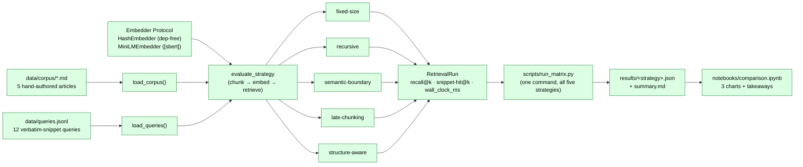
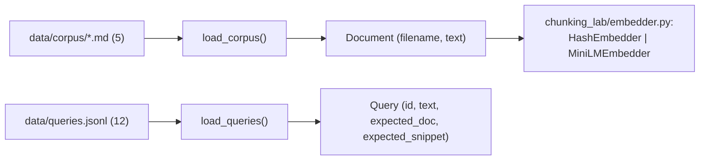
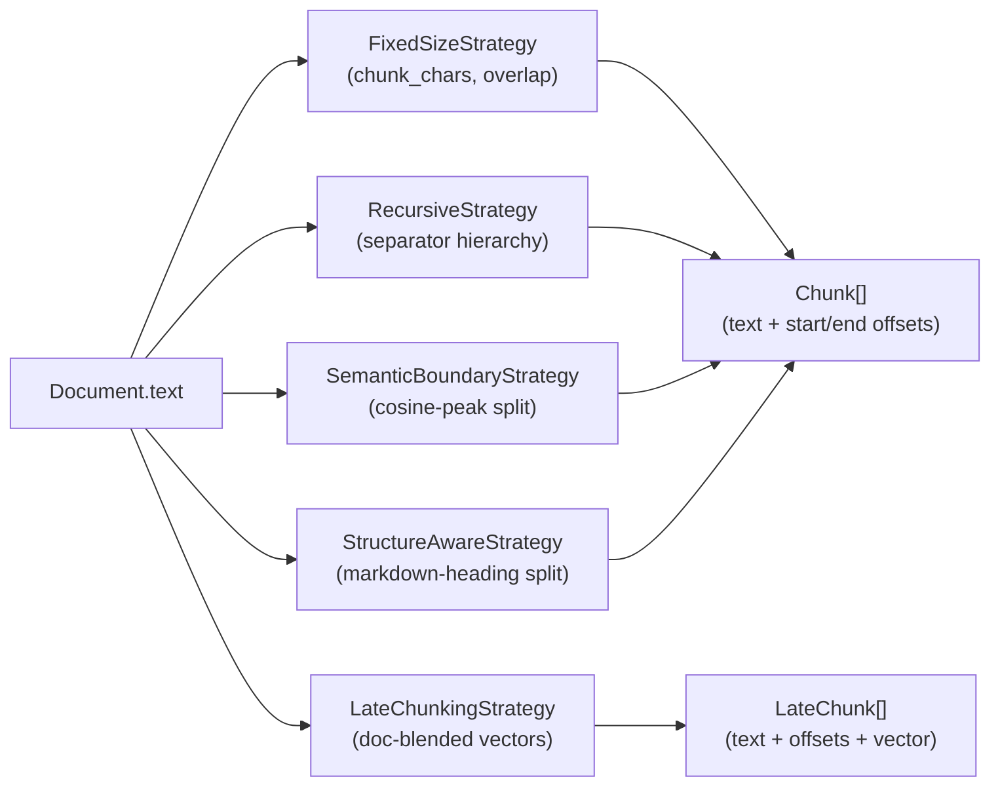
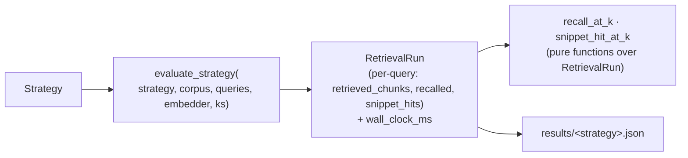
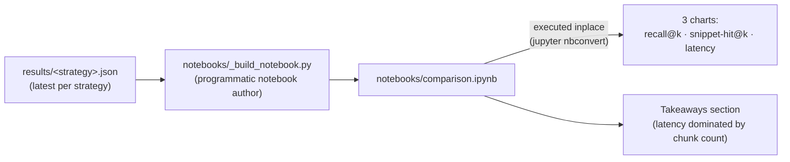

# Architecture

A small lab that pins one corpus + one query set + one embedder, then
swaps chunking strategies as the only variable. Five strategies ship;
one metrics matrix scores them; one comparison notebook visualizes the
results.

## Integrated comparison flow

**Stack-level invariants.**

- The substrate is *pinned* (D-002): same corpus, same queries, same
  embedder model across every strategy. Chunking is the only variable.
- The package is dep-free at import (D-003). MiniLM lives behind the
  `[sbert]` extra; the notebook stack lives behind the `[notebook]`
  extra (D-010). CI's hermetic path is exercised on `HashEmbedder`.
- Pluggable Protocols at every seam where backends substitute:
  `Embedder` (D-003), `Strategy` (D-004). Same single-method shape used
  across the portfolio.
- Chunks carry `start_offset` / `end_offset` (D-005) so the metrics
  layer can attribute retrieved chunks back to documents without
  re-tokenizing.

---

## 1. Pinned substrate

**What it does.** Loads the five-document corpus, the twelve verbatim-
snippet queries, and the canonical embedder. Refuses to start when the
expected files are absent — silent partial substrate is the worst
failure mode in a comparative experiment.

**Composes with.** Read by every strategy and by the metrics layer.
The corpus + queries + canonical model name are also exported as
`CANONICAL_EMBEDDING_MODEL` so the substrate is identifiable at the
type level when downstream consumers want to assert their pipeline
matches.

**Why these decisions.**

- **D-002.** Pinning corpus + queries + embedder is non-negotiable for
  a comparison experiment. Letting strategies choose their own
  substrate makes "strategy A wins" meaningless.
- **D-003.** `HashEmbedder` is the dep-free default; `MiniLMEmbedder`
  is opt-in behind the `[sbert]` extra so CI doesn't download model
  weights per run.

---

## 2. Five chunking strategies

**What they do.** Five modules under `chunking_lab/strategies/`, each
exposing a single `chunk()` method (D-004). One reader can copy any
one strategy without dragging in siblings.

**Composes with.** `evaluate_strategy()` in the metrics layer
iterates them all uniformly through the `Strategy` Protocol.

**Why these decisions.**

- **D-004.** Each strategy is its own module + a single-method
  Protocol seam. Cookbook principle: a reader can copy one strategy
  out of the repo into their app.
- **D-005.** `Chunk` carries `start_offset` / `end_offset` back into
  the source text — the universal join key the metrics layer uses to
  attribute retrieved chunks to documents without re-tokenizing.
- **D-006.** `LateChunkingStrategy` returns `LateChunk[]` (chunk plus
  vector pairs) because its vectors derive from document-level context
  and can't be recomputed from chunk text alone. The other four
  strategies return `Chunk[]` only; the metrics layer routes late
  chunking through a separate `chunk_with_vectors` call so it's not
  re-embedded by the standard pipeline.

---

## 3. Retrieval metrics matrix

**What it does.** Pure-function metrics (no SQLite, D-007) compute
recall@k and snippet-hit@k for each (strategy, query) pair, plus a
wall-clock-ms timing for the full chunk → embed → retrieve pipeline
per strategy (D-009).

**Composes with.** `scripts/run_matrix.py` runs all five strategies in
one command and persists per-strategy JSON plus a summary markdown.
The notebook (§4) is the visualization consumer; the JSON shape is
the contract between layers.

**Why these decisions.**

- **D-007.** Metrics are pure functions over `RetrievalRun`. No
  SQLite, no module-global accumulator. Matches the
  `llm-eval-harness` D-010 posture: CI runners are ephemeral; one
  current vs one baseline is enough.
- **D-008.** `snippet_hit@k` is a *structural* faithfulness proxy
  (verbatim substring match in the top-k retrieved chunks), not an
  LLM-judge call. Cheap, hermetic, gates strategies that fragment
  passages — and downstream consumers can stack an LLM judge on top
  via `llm-eval-harness` if they want semantic faithfulness.
- **D-009.** `RetrievalRun.wall_clock_ms` is measured by
  `evaluate_strategy` itself because that's the only place with
  visibility into the full chunk → embed → retrieve pipeline.
  Defaults to `0.0` so JSON files written before D-009 still load.
- **D-011.** `evaluate_strategy()` enforces the late-chunking embedder
  consistency contract at runtime: if a `LateChunkingStrategy` is
  passed alongside an embedder whose `model_name` doesn't match the
  strategy's embedder, the call raises `ValueError` (rather than
  silently producing mismatched embedding spaces and garbage recall).
  The constraint was documented in `materialize_vectors` before; D-011
  makes it loud, since silent numerical-quality bugs in a *strategy*
  are exactly the kind of bug this repo's credibility depends on
  catching.

---

## 4. Comparison notebook + takeaways

**What it does.** A Jupyter notebook that reads the latest run per
strategy from `results/`, renders three charts (recall@k, snippet-hit@k,
wall-clock latency), and writes the honest takeaways inline. The
notebook is committed with chart outputs so a reader who doesn't
install the extras can still see the result.

**Composes with.** Reads only the JSON written by the metrics matrix
— so the notebook can be regenerated by a reader without rerunning the
matrix, and the matrix can run without the notebook stack installed.

**Why these decisions.**

- **D-010.** Notebook deps (`matplotlib`, `jupyter`, `nbformat`) live
  behind the `[notebook]` extra. Parallels D-003 (`[sbert]`). Base CI
  passes without these — `tests/test_notebook.py` uses
  `pytest.importorskip("nbformat")` so the absence is a skip, not a
  failure.

---

## 5. Cross-cutting: atomic file writes (#33)

`chunking_lab/io_utils.py` exposes `atomic_write_text`, the
package-level helper that `scripts/run_matrix.py` (and any future
operator-facing writer) routes through when persisting matrix
results. It writes to a `<dest>.tmp` sibling in the same directory,
`fsync`s, then `os.replace`s into place — operators reading
`results/*.json` never see a half-written matrix from a
`KeyboardInterrupt` mid-run.

**Why these decisions.**

- **D-012.** Helper lives at the package level rather than
  file-private to `scripts/run_matrix.py`, matching the cross-repo
  standard set by `rag-production-kit`, `llm-eval-harness`,
  `embedding-model-shootout`, `prompt-regression-suite`, and
  `python-async-llm-pipelines`. Centralizes the `os.replace` surface
  to one monkey-patch target for the atomic-write test suite.

---

## Where to look next

- **Substrate** — `chunking_lab/corpus.py`, `chunking_lab/queries.py`,
  `data/corpus/*.md`, `data/queries.jsonl`.
- **Strategies** — `chunking_lab/strategies/{fixed,recursive,semantic,late,structure}.py`.
- **Metrics matrix** — `chunking_lab/metrics.py`, `scripts/run_matrix.py`,
  `results/*.json`.
- **Notebook** — `notebooks/comparison.ipynb`,
  `notebooks/_build_notebook.py`.
- **Design decisions** — `MEMORY/core_decisions_human.md` for prose,
  `MEMORY/core_decisions_ai.md` for the structured log.
