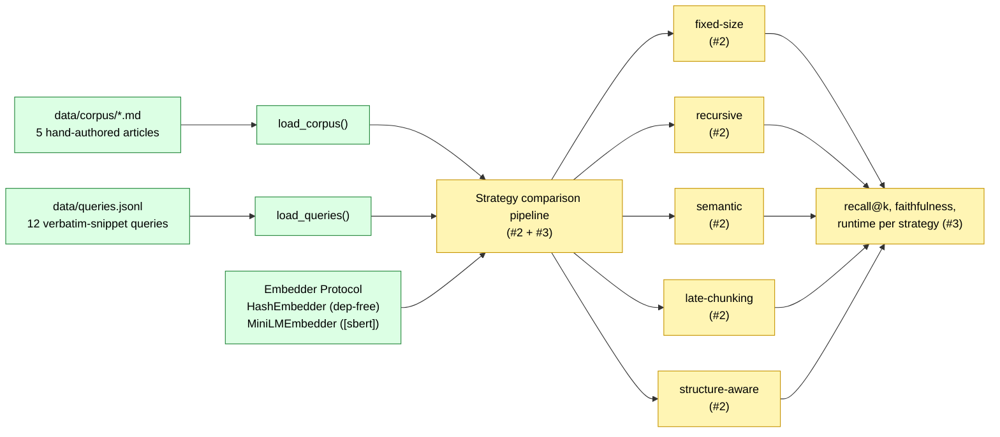

# Architecture

## Shipped (this PR — issue #1)

The pinned substrate:

- **Corpus.** Five Markdown technical articles in `data/corpus/`,
  authored for this repo (MIT). Heterogeneous structure (headings,
  paragraphs, code blocks) so chunking strategies' differences show up.
- **Queries.** Twelve verbatim-snippet queries in `data/queries.jsonl`.
  A query passes when a strategy retrieves a chunk that contains the
  `expected_snippet` from the `expected_doc`.
- **Embedder.** `Embedder` Protocol + `HashEmbedder` (dep-free
  reference) + `MiniLMEmbedder` (behind `[sbert]` optional extra).
  Canonical model: `sentence-transformers/all-MiniLM-L6-v2` (384-d).

## Pending

- **Issue #2:** the five strategies, each as a module exposing
  `chunk(text, **opts) -> list[Chunk]` with unit tests and a
  per-strategy runtime number.
- **Issue #3:** the retrieval metrics matrix. One command runs all
  five strategies across all twelve queries, persists per-strategy
  numbers to `results/`, surfaces them in `docs/benchmarks.md`.
