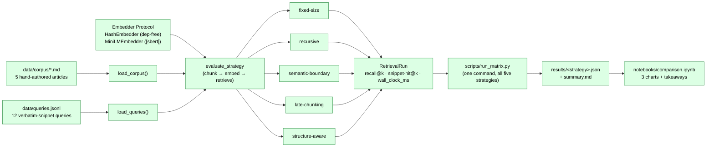
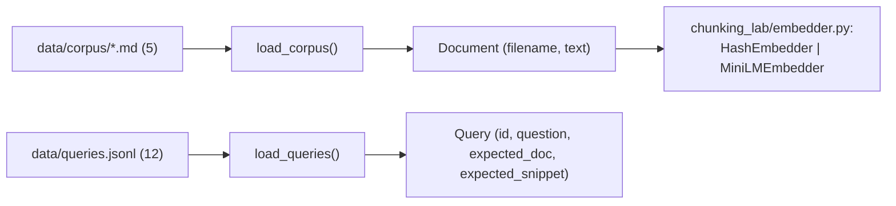
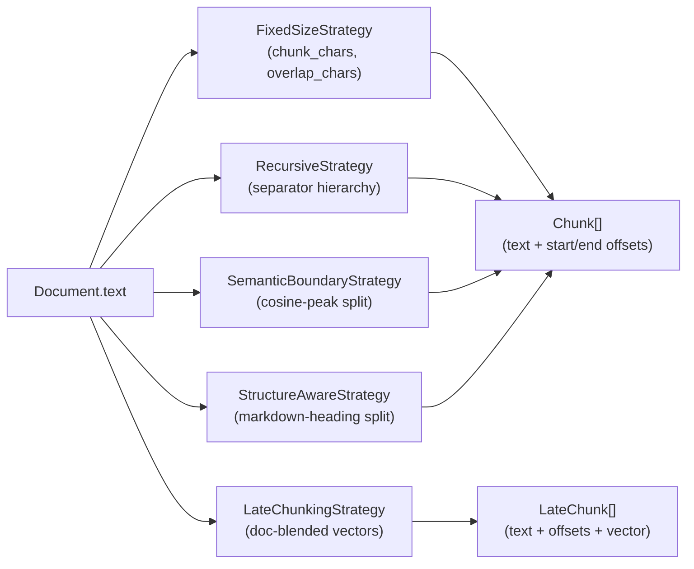
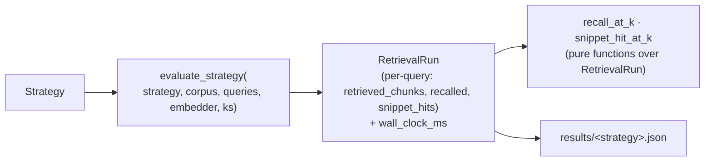
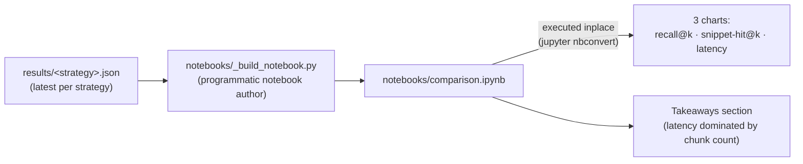

# Architecture

A small lab that pins one corpus + one query set + one embedder, then
swaps chunking strategies as the only variable. Five strategies ship;
one metrics matrix scores them; one comparison notebook visualizes the
results.

## Integrated comparison flow

```mermaid
flowchart LR
    classDef shipped fill:#dcffe4,stroke:#22863a,color:#000

    Docs["data/corpus/*.md<br/>5 hand-authored articles"]:::shipped --> CorpusLoader["load_corpus()"]:::shipped
    Queries["data/queries.jsonl<br/>12 verbatim-snippet queries"]:::shipped --> QueriesLoader["load_queries()"]:::shipped
    Embedder["Embedder Protocol<br/>HashEmbedder (dep-free)<br/>MiniLMEmbedder ([sbert])"]:::shipped --> Pipeline

    CorpusLoader --> Pipeline["evaluate_strategy<br/>(chunk → embed → retrieve)"]:::shipped
    QueriesLoader --> Pipeline

    Pipeline --> S1["fixed-size"]:::shipped
    Pipeline --> S2["recursive"]:::shipped
    Pipeline --> S3["semantic-boundary"]:::shipped
    Pipeline --> S4["late-chunking"]:::shipped
    Pipeline --> S5["structure-aware"]:::shipped

    S1 & S2 & S3 & S4 & S5 --> Metrics["RetrievalRun<br/>recall@k · snippet-hit@k · wall_clock_ms"]:::shipped

    Metrics --> RM["scripts/run_matrix.py<br/>(one command, all five strategies)"]:::shipped
    RM --> Results["results/&lt;strategy&gt;.json<br/>+ summary.md"]:::shipped
    Results --> Notebook["notebooks/comparison.ipynb<br/>3 charts + takeaways"]:::shipped
```

**Stack-level invariants.**

- The substrate is *pinned* (D-002): same corpus, same queries, same
  embedder model across every strategy. Chunking is the only variable.
- The package is dep-free at import (D-003). MiniLM lives behind the
  `[sbert]` extra; the notebook stack lives behind the `[notebook]`
  extra (D-010). CI's hermetic path is exercised on `HashEmbedder`.
- Pluggable Protocols at every seam where backends substitute:
  `Embedder` (D-003), `Strategy` (D-004). Same single-method shape used
  across the portfolio.
- Chunks carry `start_offset` / `end_offset` (D-005) so the metrics
  layer can attribute retrieved chunks back to documents without
  re-tokenizing.

---

## 1. Pinned substrate

**What it does.** Loads the five-document corpus, the twelve verbatim-
snippet queries, and the canonical embedder. Refuses to start when the
expected files are absent — silent partial substrate is the worst
failure mode in a comparative experiment.

```mermaid
flowchart LR
    F["data/corpus/*.md (5)"] --> CL["load_corpus()"]
    Q["data/queries.jsonl (12)"] --> QL["load_queries()"]
    CL --> Doc["Document (filename, text)"]
    QL --> Quer["Query (id, question, expected_doc, expected_snippet)"]
    Doc --> E["chunking_lab/embedder.py:<br/>HashEmbedder | MiniLMEmbedder"]
```

**Composes with.** Read by every strategy and by the metrics layer.
The corpus + queries + canonical model name are also exported as
`CANONICAL_EMBEDDING_MODEL` so the substrate is identifiable at the
type level when downstream consumers want to assert their pipeline
matches.

**Why these decisions.**

- **D-002.** Pinning corpus + queries + embedder is non-negotiable for
  a comparison experiment. Letting strategies choose their own
  substrate makes "strategy A wins" meaningless.
- **D-003.** `HashEmbedder` is the dep-free default; `MiniLMEmbedder`
  is opt-in behind the `[sbert]` extra so CI doesn't download model
  weights per run.

**Pre-flight validator (#37).** `chunking_lab.validate.validate_queries(path, corpus_dir=None)`
walks `data/queries.jsonl` in *collecting* mode and returns every
malformed row in one pass — the opposite posture to `load_queries`'s
fail-fast raise on the first bad line. Seventeen finding codes cover
JSON-shape errors (`malformed_json`, `not_an_object`), per-field schema
gaps (`missing_<field>`, `non_string_<field>`, `empty_<field>` for each
of `id` / `question` / `expected_doc` / `expected_snippet`),
uniqueness (`duplicate_id`), the empty-file case (`empty`), and — when
`corpus_dir` is passed — the cross-file invariant
`expected_doc_not_found` that catches typo'd doc references that would
otherwise silently invalidate recall. Runs as
`python -m chunking_lab.validate <path> [--corpus-dir DIR] [--json]`;
exit codes 0 / 1 / 2 are uniform with `eval-harness validate`,
`prompt-snap validate`, and `emb-shootout corpus validate` in the
sister repos so consumers can chain validators.

---

## 2. Five chunking strategies

**What they do.** Five modules under `chunking_lab/strategies/`, each
exposing a single `chunk()` method (D-004). One reader can copy any
one strategy without dragging in siblings.

```mermaid
flowchart LR
    DOC["Document.text"] --> S1["FixedSizeStrategy<br/>(chunk_chars, overlap_chars)"]
    DOC --> S2["RecursiveStrategy<br/>(separator hierarchy)"]
    DOC --> S3["SemanticBoundaryStrategy<br/>(cosine-peak split)"]
    DOC --> S4["LateChunkingStrategy<br/>(doc-blended vectors)"]
    DOC --> S5["StructureAwareStrategy<br/>(markdown-heading split)"]

    S1 --> CK["Chunk[]<br/>(text + start/end offsets)"]
    S2 --> CK
    S3 --> CK
    S5 --> CK
    S4 --> CKV["LateChunk[]<br/>(text + offsets + vector)"]
```

**Composes with.** `evaluate_strategy()` in the metrics layer
iterates them all uniformly through the `Strategy` Protocol.

**Why these decisions.**

- **D-004.** Each strategy is its own module + a single-method
  Protocol seam. Cookbook principle: a reader can copy one strategy
  out of the repo into their app.
- **D-005.** `Chunk` carries `start_offset` / `end_offset` back into
  the source text — the universal join key the metrics layer uses to
  attribute retrieved chunks to documents without re-tokenizing.
- **D-006.** `LateChunkingStrategy` returns `LateChunk[]` (chunk plus
  vector pairs) because its vectors derive from document-level context
  and can't be recomputed from chunk text alone. The other four
  strategies return `Chunk[]` only; the metrics layer routes late
  chunking through a separate `chunk_with_vectors` call so it's not
  re-embedded by the standard pipeline.

---

## 3. Retrieval metrics matrix

**What it does.** Pure-function metrics (no SQLite, D-007) compute
recall@k and snippet-hit@k for each (strategy, query) pair, plus a
wall-clock-ms timing for the full chunk → embed → retrieve pipeline
per strategy (D-009).

```mermaid
flowchart LR
    STR["Strategy"] --> EV["evaluate_strategy(<br/>strategy, corpus, queries, embedder, ks)"]
    EV --> RR["RetrievalRun<br/>(per-query: retrieved_chunks, recalled, snippet_hits)<br/>+ wall_clock_ms"]
    RR --> METRICS["recall_at_k · snippet_hit_at_k<br/>(pure functions over RetrievalRun)"]
    RR --> WRITE["results/&lt;strategy&gt;.json"]
```

**Composes with.** `scripts/run_matrix.py` runs all five strategies in
one command and persists per-strategy JSON plus a summary markdown.
The notebook (§4) is the visualization consumer; the JSON shape is
the contract between layers.

**Why these decisions.**

- **D-007.** Metrics are pure functions over `RetrievalRun`. No
  SQLite, no module-global accumulator. Matches the
  `llm-eval-harness` D-010 posture: CI runners are ephemeral; one
  current vs one baseline is enough.
- **D-008.** `snippet_hit@k` is a *structural* faithfulness proxy
  (verbatim substring match in the top-k retrieved chunks), not an
  LLM-judge call. Cheap, hermetic, gates strategies that fragment
  passages — and downstream consumers can stack an LLM judge on top
  via `llm-eval-harness` if they want semantic faithfulness.
- **D-009.** `RetrievalRun.wall_clock_ms` is measured by
  `evaluate_strategy` itself because that's the only place with
  visibility into the full chunk → embed → retrieve pipeline.
  Defaults to `0.0` so JSON files written before D-009 still load.
- **One rule per field, shared by both paths (#180, #181, #182).**
  `RetrievalRun` is written by `evaluate_strategy` and read back by
  `from_json`, and every field contract lives in exactly one function
  that both paths call. The three issues above are three instances of
  the same drift: a rule enforced on read and not on write, so the
  class serialised payloads its own loader refused. #180/#181 closed
  it for the scalar numeric fields (`n_queries`, `n_chunks_total`,
  `wall_clock_ms`, via `chunking_lab/_fields.py`); #182 closed it for
  the two metric *maps*, which carry more read-side validation than
  any scalar here — key type/sign, value type/finiteness/range, and
  cross-map key-set parity (#160) — and had none of it on the write
  side. Twelve shapes constructed, serialised, and then failed their
  own reader; a `nan` recall did not even need a round trip to do
  harm, because `scripts/run_matrix.py` renders `results/summary.md`
  from the in-memory runs and published a literal `nan` cell. The
  shared definition is `_validate_metric_maps`, and
  `test_both_paths_reach_the_same_function_object` pins that both call
  sites reach it rather than each carrying a copy — a copy is what
  produced all three issues. The one genuine asymmetry that remains is
  key *coercion*: JSON names are strings, so the read path runs
  `_coerce_metric_keys` first and the write path does not need it.
- **What the `results/summary.md` snapshot lock does and does not cover
  (#190).** `tests/test_summary_snapshot.py` re-renders the committed
  `canonical__*.json` fixtures through `_render_summary` and compares the
  result to the committed `summary.md`. That pins the **renderer**: it
  asks whether the markdown agrees with the JSONs beside it. It never
  asked whether those JSONs agree with the **pipeline**, so a chunking
  strategy whose recall regressed would leave both the fixtures and the
  published table exactly as committed and the lock exactly as green.
  Measured: dropping `FixedSizeStrategy(chunk_chars=600)` to `520` turns
  exactly one assertion red, and it is the new
  `test_committed_json_matches_a_fresh_pipeline_run`; the pre-existing
  renderer assertion stays green.

  The original scoping reason — the committed JSONs "carry
  `wall_clock_ms` baked in, so feeding them back through the renderer
  produces a deterministic markdown" — is true of `wall_clock_ms` and of
  nothing else. Two fresh runs and the committed fixtures agree
  bit-for-bit on every other field, because `HashEmbedder` is
  deterministic, and the whole five-strategy matrix takes 0.2 s. So the
  pipeline lock re-runs the real script and compares every field except
  that one, with `_HOST_DEPENDENT_FIELDS` pinned to exactly
  `{"wall_clock_ms"}` and a determinism arm that justifies the exclusion
  by measurement rather than assumption.

  Three smaller defects in the same file came from following its own
  failure message. `REGEN_HINT` printed `python scripts/run_matrix.py`,
  which writes `results/<timestamp>__summary.md` and leaves
  `results/summary.md` untouched — so the command the failing assertion
  printed could not refresh the file the assertion was about; the flag's
  own help text (`--canonical-out`) already said so. `_committed_run_jsons`
  globbed `results/*.json` while `.gitignore` defines the committed set as
  `summary.md` plus `canonical__*.json`, so the five gitignored scratch
  files that command produced turned five tests red and reported them as
  "committed". And `_runs_in_strategy_order` built its index with a dict
  comprehension over a sorted list, resolving a duplicate strategy key by
  whichever filename sorted later — silently, which is why the summary
  assertion stayed green while the per-strategy count assertion failed: a
  timestamp prefix starts with a digit (`0x30`–`0x39`) and `canonical__`
  with `c` (`0x63`), so the canonical file happened to win. The lock was
  correct by byte ordering and nothing stated it.
- **The fourth construction boundary (#184).** `QueryResult` was the
  last class in `metrics.py` with no rule at all, and its invariant
  was stated in a *comment*: "Length matches
  `retrieved_doc_ids_in_rank_order`". Enforced on neither path, and
  neither were the element types — eight shapes constructed and
  survived `to_json` → `from_json` unchanged, including flags shorter
  than the ids, longer, empty against two ids, and `(1, 0)` /
  `("yes", "no")` / `(None, None)` in a field annotated
  `tuple[bool, ...]`. `bool` and not `int`, because `any()` and
  `sum()` treat `1` and `True` identically, so an int flag is
  invisible to every consumer that would otherwise catch it — the
  same bool-is-int vein as #29/#31. Here the shared definition needed
  no arranging: `from_json` builds through `cls(...)`, so
  `__post_init__` *is* the one door, and
  `test_from_json_states_no_rule_of_its_own` pins that it stayed that
  way. The `str` fields stay unchecked on purpose — `RetrievalRun`
  does not type-check `strategy_name` either, and that boundary has
  its own test rather than being left to inference.
- **And the container axis, which none of those four touched (#186).**
  `from_json` has guarded four containers since #114/#118 — the
  top-level payload, both metric maps, `per_query` and `notes` — each
  with a comment about a raw `TypeError`/`AttributeError` "escaping the
  documented `KeyError`/`ValueError` loud contract". `__post_init__`
  guarded every *numeric* field and no container. Six shapes
  constructed and then raised exactly those types out of `to_json`,
  and two round-tripped silently: `notes="chunk overlap looks high"`
  became **24 single-character notes**, because `to_json` writes
  `list(self.notes)` and `from_json`'s guard for that very field names
  the harm — "a JSON string silently char-splats into a per-character
  list" — while calling itself "the last list container built via
  `list(...)` on the *read* path". `_validate_per_query` and
  `_validate_notes` are the shared definitions, and `from_json` keeps
  its own container guards because they are **not** redundant: the
  coercion between the two launders the error, since `list("abc")` is
  a perfectly good `list[str]` by the time the constructor sees it.
  The scope line #184 drew still holds — that reason is about scalar
  `str` fields and says nothing about containers, which `from_json`
  does guard.
- **And `QueryResult` was the same table one class up (#188).** Its
  `from_json` guards both container fields and its comment names both
  harms verbatim; its `__post_init__` checked the *elements* (bool
  flags) and the *length parity*, and neither container's type. Two
  things are sharper than #186's version of the identical defect.
  First, the raw `TypeError`s came out of the guard method **itself** —
  `len()` and `enumerate()` are called before either `raise ValueError`,
  so the method that exists to turn bad input into a loud `ValueError`
  raised the type that contract converts. Second, the length-parity
  invariant *hid* the string row: `len("abc") == 3`, so three real bool
  flags make the two "parallel per-rank arrays" agree precisely because
  a string's length is its character count — the check written to catch
  divergence is what made this input look correct, and it round-tripped
  as three document ids `a`, `b`, `c`. The `bytes` row is worse: ids
  become the integers `97, 98, 99`. Fixed by making `QueryResult` the
  third caller of `_is_sequence_container`, **before** the two existing
  checks, because both of them crash on the inputs it rejects — the
  ordering has its own test, and moving the guard last leaves seven rows
  red.
- **D-011.** `evaluate_strategy()` enforces the late-chunking embedder
  consistency contract at runtime: if a `LateChunkingStrategy` is
  passed alongside an embedder whose `model_name` doesn't match the
  strategy's embedder, the call raises `ValueError` (rather than
  silently producing mismatched embedding spaces and garbage recall).
  The constraint was documented in `materialize_vectors` before; D-011
  makes it loud, since silent numerical-quality bugs in a *strategy*
  are exactly the kind of bug this repo's credibility depends on
  catching.

---

## 4. Comparison notebook + takeaways

**What it does.** A Jupyter notebook that reads the latest run per
strategy from `results/`, renders three charts (recall@k, snippet-hit@k,
wall-clock latency), and writes the honest takeaways inline. The
notebook is committed with chart outputs so a reader who doesn't
install the extras can still see the result.

```mermaid
flowchart LR
    RES["results/&lt;strategy&gt;.json<br/>(latest per strategy)"] --> LOAD["notebooks/_build_notebook.py<br/>(programmatic notebook author)"]
    LOAD --> NB["notebooks/comparison.ipynb"]
    NB -- "executed inplace<br/>(jupyter nbconvert)" --> CHARTS["3 charts:<br/>recall@k · snippet-hit@k · latency"]
    NB --> TAKE["Takeaways section<br/>(latency dominated by chunk count)"]
```

**Composes with.** Reads only the JSON written by the metrics matrix
— so the notebook can be regenerated by a reader without rerunning the
matrix, and the matrix can run without the notebook stack installed.

**Why these decisions.**

- **D-010.** Notebook deps (`matplotlib`, `jupyter`, `nbformat`) live
  behind the `[notebook]` extra. Parallels D-003 (`[sbert]`). Base CI
  passes without these — `tests/test_notebook.py` uses
  `pytest.importorskip("nbformat")` so the absence is a skip, not a
  failure.

---

## 5. Cross-cutting: atomic file writes (#33)

`chunking_lab/io_utils.py` exposes `atomic_write_text`, the
package-level helper that `scripts/run_matrix.py` (and any future
operator-facing writer) routes through when persisting matrix
results. It writes to a `<dest>.tmp` sibling in the same directory,
`fsync`s, then `os.replace`s into place — operators reading
`results/*.json` never see a half-written matrix from a
`KeyboardInterrupt` mid-run.

**Why these decisions.**

- **D-012.** Helper lives at the package level rather than
  file-private to `scripts/run_matrix.py`, matching the cross-repo
  standard set by `rag-production-kit`, `llm-eval-harness`,
  `embedding-model-shootout`, `prompt-regression-suite`, and
  `python-async-llm-pipelines`. Centralizes the `os.replace` surface
  to one monkey-patch target for the atomic-write test suite.
- **D-013.** A non-strict `mypy` gate runs over `chunking_lab` in the
  CI lint job and again as `tests/test_mypy_clean.py`, both invoking a
  bare `mypy` so they read exactly the `[tool.mypy]` block in
  `pyproject.toml` — the test, the CI step and a developer's local run
  therefore cannot drift to different scopes. The rationale differs
  from the two sibling repos that already have one: `llm-eval-harness`
  (D-016) and `llm-cost-optimizer` (D-014) justify theirs by shipping a
  `py.typed` marker, so their annotations are a downstream contract.
  `chunking_lab` ships no marker; the case here is **latent green** rot
  — the annotations existed, nothing machine-checked them, and #164 is
  the proof: two `no-redef` errors sat in
  `chunking_lab/strategies/recursive.py` unnoticed while CI was green
  the whole time, because no gate ran. No blanket
  `ignore_missing_imports` (a typo'd import must still surface); the
  optional `sentence_transformers` import from D-003's `[sbert]` extra
  is handled by a per-module override rather than an inline ignore,
  which with `warn_unused_ignores` on would itself become an error the
  moment someone installs the extra. The original scope excluded
  `scripts/` and `tests/`; `scripts/` joined it in D-014 below and
  `tests/` in D-015, so a bare `mypy` now covers every directory the
  repo tracks Python under.
- **D-014 (#165).** The gate covers `scripts/` as well as the package.
  It could not before: `mypy chunking_lab scripts` stopped with
  `Source file found twice under different module names: "run_matrix"
  and "scripts.run_matrix"` and checked *nothing*, so nobody knew
  whether `scripts/` was clean — and `scripts/run_matrix.py` writes the
  `results/*.json` the README table and the notebook are derived from.
  That error was a true finding rather than a layout quirk: the suite
  really did import the file both ways, and Python makes each name a
  separate module object, so the body ran twice and a
  `monkeypatch.setattr` on one copy could not reach the other. The fix
  is therefore in two halves, and neither alone would do. `mypy_path`
  plus `explicit_package_bases` make the *mapping* unambiguous (one
  file, one module name, rooted at the repo); normalizing the four bare
  `from run_matrix import …` sites in `tests/test_metrics.py` to
  `scripts.run_matrix` removes the *cause*. Adding an `__init__.py` under
  `scripts/`, the other option #165 listed, was declined — it changes how
  `python scripts/run_matrix.py` resolves and would not have removed the
  duplicate either. The gate then reported one real error, a dead
  `# type: ignore[attr-defined]`, which was removed rather than
  silenced. `tests/` stayed out of scope in D-014, but *measured* rather
  than unknown, and tracked separately as #174 — which D-015 closes.
- **D-015 (#174).** The gate covers `tests/` too, completing the scope.
  D-014 deferred it for two reasons and both are settled here: it
  carries a dependency change (`types-PyYAML` in the `dev` extra, chosen
  over a `module = "yaml.*"` override because that would be silencing,
  and there is nothing to annotate at the call sites — the untyped thing
  is the library), and two of its findings needed reading as possible
  test bugs before being annotated away. The measured count was 11, not
  the 12 the issue estimated. Three were dead suppressions, and one was
  the same one-file-two-names shape D-014 had just fixed for
  `run_matrix` — `notebooks/_build_notebook.py`, imported bare from two
  test files after a `sys.path` insert, in the second script directory
  D-014's guard did not look at. So `tests/test_script_module_identity.py`
  (renamed from `test_run_matrix_single_module_identity.py`) now
  *discovers* the script directories and their modules from what git
  tracks, instead of naming one of each. Two findings were kept as
  narrow `# type: ignore`s because the input really is deliberately
  ill-typed — a `float` handed to a `Sequence[int]` validator, an `int`
  handed to a `str` dataclass field — and in one of those cases the
  function's signature was *annotated* so mypy would check the body
  again, since an unannotated test body is skipped and the suppression
  had gone dead only for that reason.

---

## Where to look next

- **Substrate** — `chunking_lab/corpus.py`, `chunking_lab/queries.py`,
  `chunking_lab/validate.py` (#37 pre-flight),
  `data/corpus/*.md`, `data/queries.jsonl`.
- **Strategies** — `chunking_lab/strategies/{fixed,recursive,semantic,late,structure}.py`.
- **Metrics matrix** — `chunking_lab/metrics.py`, `scripts/run_matrix.py`,
  `results/*.json`.
- **Notebook** — `notebooks/comparison.ipynb`,
  `notebooks/_build_notebook.py`.
- **Design decisions** — `MEMORY/core_decisions_human.md` for prose,
  `MEMORY/core_decisions_ai.md` for the structured log.
